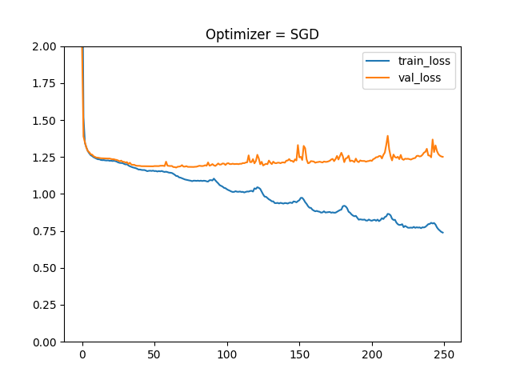
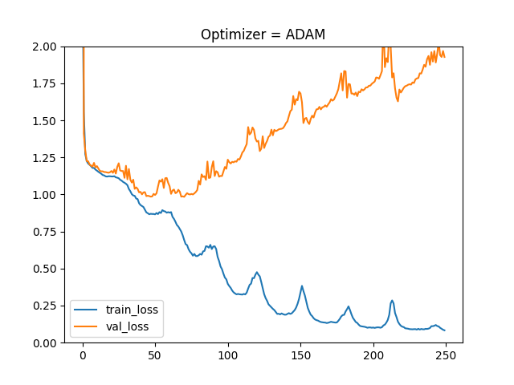
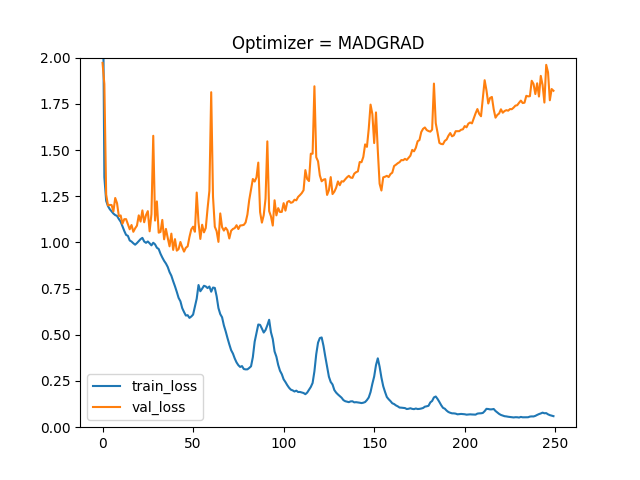
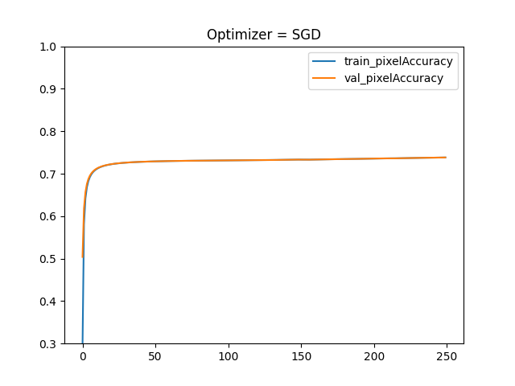
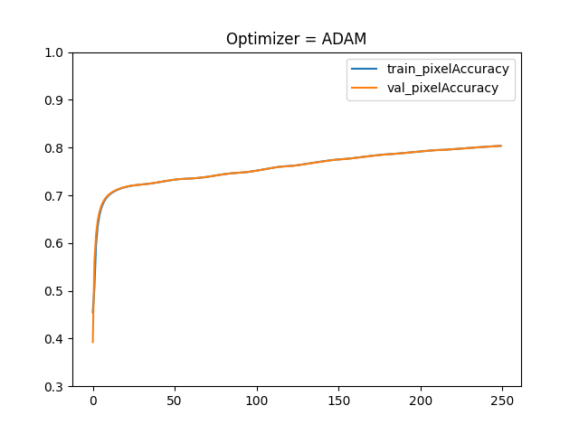
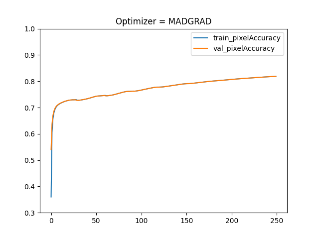

## MADGRAD-Segmentation-Pytorch-Performance
    Compare the performance of MADGRAD against Adam and SGD for segmentation model training.

### CrossEntropyLoss

### Pixel Accuracy

##### VOC2012 Segmentation Training 
    -  SDG
        ~/anaconda3/envs/pytorch17_102/bin/python train.py SGD
    -  Adam
        ~/anaconda3/envs/pytorch17_102/bin/python train.py Adam
    -  MADGRAD
        ~/anaconda3/envs/pytorch17_102/bin/python train.py MADGRAD
